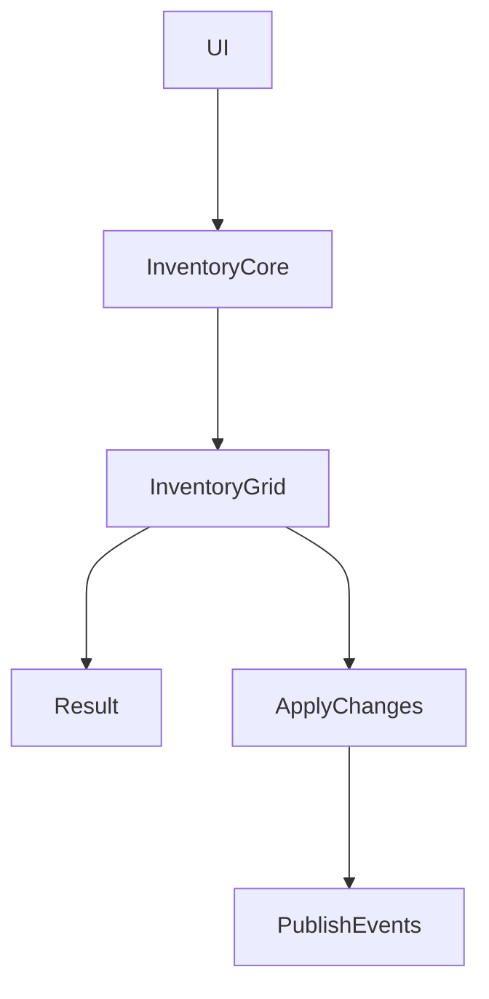

# 📦 Inventory System Architecture

## 🧠 Overview

A grid-based inventory system inspired by Resident Evil, designed with a focus on:

- Decoupled architecture
- Testability
- Scalability
- UI-agnostic logic

---
## 🧱 Core Concepts

### InventoryCore

High-level API responsible for:

- Managing item lifecycle
- Orchestrating grid operations
- Publishing events

👉 Acts as a **facade** over lower-level systems.

### InventoryGrid

Handles:

- Spatial validation
- Slot occupation rules

👉 Responsible for **where items can be placed**, not _what happens when they are_

### InventoryGridSlot

Represents:

- A single grid cell
- Stores reference to an item

👉 Keeps grid state consistent

### GridPosition

Lightweight value struct used for:

- Addressing positions in the grid
- Performing relative movement

### InventoryEvents

Defines:

- All events related to inventory changes

👉 Centralized event contracts for decoupled communication

---
## 🔄 Data Flow



---
## ⚙️ Design Decisions

### ✅ Separation of Concerns

- Core handles orchestration
- Grid handles spatial logic
- Slots handle storage

### ✅ Event-Driven Communication

All changes publish events through the Event Bus:

- No direct UI dependencies
- Systems remain loosely coupled

### ✅ Interface-Based Design

All major components use interfaces:

- Enables easy extension
- Supports mocking for testing

### ✅ Pure C# Core

No Unity dependencies:

- Fully testable
- Can run in non-Unity environments (e.g. server-side)

---
## 🧪 Testability

The system is designed so that:

- All core logic can be unit tested
- No GameObjects or scenes are required
- Deterministic behavior ensures reliable tests

---
## 🚀 Scalability Considerations

### 🔹 Command → Result pattern (planned / partial)

Operations return results instead of directly mutating state:

- Enables simulation before applying changes
- Supports undo/redo systems
- Prepares for multiplayer validation

### 🔹 Future Extensions

- Non-rectangular items
- Item rotation previews
- Multiplayer synchronization
- Save/load systems
- Inventory persistence

---
## 🛠️ Debug Tools (Editor Integration)

A custom debug editor window was created to interact with the inventory system at runtime.

### ✨ Features

- Selects the active inventory instance via Service Locator
- Allows adding items defined as ScriptableObjects
- Supports manual placement and quick testing of grid behavior
- Enables rapid iteration without relying on gameplay flow

### 🧠 Purpose

This tool was designed to:

- Speed up development and testing of inventory behaviors
- Validate grid logic and edge cases quickly
- Reduce dependency on in-game UI during development
- Provide a controlled environment for debugging

### 🔗 Integration

The tool retrieves the active inventory instance through the Service Locator:

``` csharp
var inventory = ServiceLocator.GetService<IInventoryCore>();
```

---
## ⚠️ Trade-offs

### Service Locator usage

- Simplifies access to global systems
- Can introduce hidden dependencies if overused

### Grid mutation (current vs future)

- Currently handles slot mutation internally
- Planned evolution toward explicit "Apply" phase for safer state control

---
## 🏁 Summary

This system is designed to:

- Be easy to use from the outside
- Remain flexible internally
- Scale with increasing complexity
